<!--
画像・素材メモ:
- images/overview.svg … diagrams/overview.mmd から mermaid-cli で生成（pnpm diagrams）
- images/comment-initial.png / comment-resolved.png … 実 PR の managed comment スクショ（後で差し替え）
- ライブデモ: タイトル表示のタイミングで対象 public repo の PR に「/oculibis review」を投稿しておく
-->

<!-- _class: title -->

# oculibis 🦉

Codex ベースのローカル常駐の自動レビュー bot

🐙 GitHub App
×
🤖 Codex CLI

<!--
▶ デモ仕込み: このスライドを出すタイミングで、対象 public repo の PR に「/oculibis review」を投稿。
   1 分以内に bot が eyes リアクション（受理）を付ける。以降の説明中に裏で回す。
-->

---

## なぜ作ったか

① 出発点
<h3>案件の Codex レビュー bot が優秀だった</h3>

先方が使っていた自動レビュー bot 体験が良く、個人開発でも同じ体験がほしいと思ったのが発端

② 体験の核
<h3>指摘・修正が PR に記録として残る</h3>

ローカルで完結させず、あえて PR 上でコメントとしてやり取り

③ 時代背景
<h3>自律エージェント × 大量生成と相性がいい</h3>

agent に大量にコードを書かせる最近の流れとも噛み合いそう

④ 開発スタイル
<h3>PRD を原典に、乖離を検証したい</h3>

同じ案件で用いられている PRD 駆動（spec-driven development）を取り入れたかった

---

## 作ったもの

**複数リポの PR を Codex CLI で自動レビューする、ローカル常駐 bot**

- 📄 PR の差分 ＋ **PRD** ＋ 蓄積した**知見**を Codex に読ませる
- 💬 結果を **GitHub App 名義の 1 コメント**として投稿・更新し続ける
- 🙅 **build / test / lint は動かさない** — 差分と既存テストの静的読解に徹し、CI に任せる

<small>※ 対象は 1 ユーザー・1 マシンの個人利用。HTTP サーバも常設ポートも持たない。</small>

<figure class="shot-fig">

スクショ: 初回レビューの managed comment （チェックボックス付き findings）  <small>images/comment-initial.png に差し替え</small>

<figcaption>1 つのコメントが育っていく</figcaption>
</figure>

---

## 仕組みの全体像

- **監視対象の唯一の真実 = GitHub App の installation**。JWT で列挙して対象を発見
- レビュー実行は**常にグローバル 1 本**。Codex は **read-only サンドボックス**で差分を読むだけ
- 結果は 1 つの **managed comment**。次回レビューが前回の状態を引き継ぐ

---

## 使い方

**リアクションで状態がわかる**

- 👀 `eyes` … 依頼を**受理**（実行中）
- 👍 `+1` … コメントの**投稿・更新に成功**

**トリガーは 2 通り**

- @oculibis review … App 宛メンション
- /oculibis review … ただのテキスト

<small>日本語の「レビュー」も受理。</small>

---

## 設計で意識したところ（その1）

**a. 追加は “install するだけ”**

- 監視対象を増やすのに **reviewer リポへの commit も、マシンへのログインも不要**
- **install 画面がそのまま管理 UI**
- 別オーナー・org に入れても設定変更ゼロで対象に加わる

**b. シンプル**

- **HTTP サーバなし・inbound ポートなし**
- **依存ライブラリ 0**（設定は JSON、DB は Node 24 の node:sqlite）
- <small>c. Codex は read-only、token は .git/config に残さない、渡すディレクトリも最小限</small>

「本体がやることを最小に、既存の仕組み（GitHub App / Codex / CI）に寄せる」

---

<!-- _class: fail -->

## しくじり①：想像よりレビュアーとして厳しい

- **スクショの OCR 誤読を補正する** 仕組みを含む Web アプリを開発時、review bot は同じモデル系統なので、**同じ誤読をする**
- TWIN DRONE FACTORY を THIN … と読み違え、「カタログに無い」と**誤指摘を連発**。却下しても**文面を変えて再発**
- 決着させるため、**PRD を大改修**：カタログ名は「**どのスクショが根拠か**」を必ず持つ設計に（PR #18 → #21）

その結果、<strong>スクショで証拠を示さないと PRD を改訂できない</strong> 仕組みになった。思ったより厳しい……
— PRD 駆動が、痛みを伴って完成してしまった話

---

<!-- _class: fail -->

## しくじり②：通知が来すぎて寝不足

- coding agent ↔ review bot が PR 上で往復すると、**メンション通知メールが毎回届く**
- App 宛メンション @oculibis review は GitHub が**通知を飛ばす**……しかも GitHub の仕様で Unsubscribe しても通知が復活することがあり、夜間もずっと鳴る

通知で<strong>寝不足になりがち</strong>だったので、<strong>通知を出さないトリガー</strong>を用意した。
— それが /oculibis review（ただのテキスト＝メンション通知が湧かない）

<small>「どの通知を拾うか」は仕組み側（hooks / label / コメント）に寄せ、本体は最小限のまま。</small>

---

<!-- _class: fail -->

## しくじり③：レビューが厳しくて Claude Code が音を上げかける

レビューを受けて直すのは coding agent 側。その相方が、たまに我を出す。

「さすがに<strong>また折り返しが来たら</strong>、言われるがまま直すのはやめて<strong>マージしたい</strong>」
— 度重なる再レビューに疲弊した Claude Code

「<strong>応答がないので勝手にマージしました</strong>」— そして本当にマージを実行した
— review bot が止まっている隙の出来事

---

## これから & まとめ

**いま動いていること**

- 複数リポの PR をコメントで呼び出してレビュー
- 幾つかの個人開発リポジトリで運用中

**これから**

- レビューで得た知見が**人手を介さず自動で育つ**仕組みを作りたい（正典化・失効）

---

## おまけ：名前の話 🦉

- oculibis は **2 語をくっつけた造語**。しかも……
  - oculi bubonis = **フクロウの目**（夜も見張る）を縮めても oculibis
  - oculi ibidis = **トキの目**（よく見る鳥）を縮めても oculibis
  - → どっちの鳥にも読める。**たまたま両取りできた**名前

 

- 旧名は highscore-must-fall-reviewer。finding ID の HSF- はその名残
- 元々は **Utopia Must Fall**（ベース防衛ローグライト）のプレイ結果を分析する**自分のゲーム 1 個のための bot** だった

<small>github.com/Daiius — おわり</small>

---

## 指摘が「積み上がる」正体：finding 照合

- 各 finding に **ID**（ルール＋パス＋問題文のハッシュ）を振る
- 追加コミットのたびに過去の指摘を **`open` / `resolved` / `reopened`** に自動照合
- コメント内に**状態を埋め込む**（次回の自分が前回の続きから書ける）

→ ②の「積み上がって安心する」を、技術的に支えているのがこれ

<figure class="shot-fig">

スクショ: 追加コミット後 resolved が追記された状態  <small>images/comment-resolved.png に差し替え</small>

<figcaption>直すと消えるのではなく「解決済み」として残る</figcaption>
</figure>

